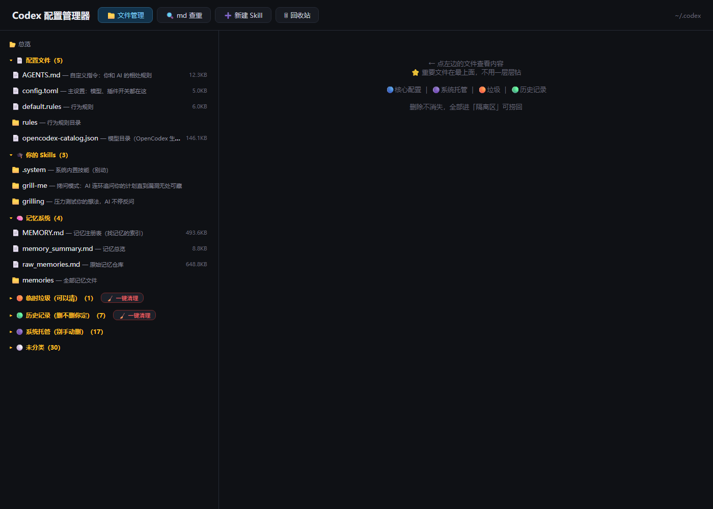

# Codex 管理器

> 把 `~/.codex` 里平时看不见的配置、Skills、记忆、历史记录和临时文件摊开来管理。



Codex 管理器是一个 Windows-first、本地运行的小工具。它提供文件浏览、
文本编辑、隔离删除、回收恢复、历史/临时目录批量清理、Markdown 查重、
Skill 模板创建，以及可选的 AI 翻译预览。

它会直接接触你的真实 `~/.codex`。先看清楚分类和路径，再点保存或清理。
分类是方便浏览的启发式判断，不是“删掉一定安全”的证明。

## 当前支持

- Windows 安装脚本、桌面快捷方式和本地 Web 管理界面。
- Python 标准库实现，无需额外安装 Web framework。
- 管理界面只绑定 `127.0.0.1`，依次尝试端口 `8799`–`8802`。
- 文件按核心配置、Skills、记忆、临时项、历史、系统托管、其他等类别展示。
- UTF-8 文本查看与编辑。
- 删除进入工具目录内的本地隔离区，可恢复到原路径。
- 精确内容相同的 Markdown 文件查重。
- 在 `~/.codex/skills/<name>/SKILL.md` 创建固定结构的 Skill。
- 可选翻译：把当前选中文本交给本机 `127.0.0.1:10100` 的
  OpenAI-compatible 代理。
- 独立 PowerShell 库存仪表盘。

当前仓库没有自动化测试目录，也没有附带 `LICENSE`。在加入并验证这些
内容以前，不应把它描述为经过完整回归测试或已经采用某个开源许可证。

## 安装

1. 安装 Python 3，并确保命令行可以运行 `python`。
2. 下载或 clone 本仓库。
3. 打开 `Codex管理器` 文件夹。
4. 双击 `① 双击我安装.bat`。
5. 桌面会出现“Codex 管理器”和“Codex 库存仪表盘”快捷方式。

更完整的图文流程见
[`Codex管理器-使用教学.md`](Codex管理器-使用教学.md)。

当前打包和安装路径以 Windows 为目标。Python 主程序可能在其他平台启动，
但仓库没有提供或验证 macOS/Linux 安装、快捷方式和完整行为支持。

## 使用前先知道的几件事

### 1. 编辑保存会立即覆盖原文件

编辑功能没有自动备份。点击保存后，原文件内容会被 UTF-8 文本直接覆盖。
删除有隔离区，编辑没有“撤销到上一个版本”的同等保护。

对于 `AGENTS.md`、`config.toml`、rules、记忆文件和 Skills，建议先手动复制
一份，或确认它们已经受版本控制/其他备份保护。

当前读取使用 UTF-8；编码未知或原本不是 UTF-8 的文件不适合在这里编辑。
看到乱码或替换字符时不要保存，否则可能造成不可逆重编码。

### 2. 删除先进入隔离区

普通删除和“一键清理”会把目标移动到：

```text
Codex管理器/零件箱/隔离区（删错了来这捞）/
```

隔离区在工具安装目录旁边，不在 `~/.codex` 内。恢复时，如果原路径已经
出现同名文件，工具会拒绝覆盖。

隔离项目超过 7 天后，会在隔离区被读取/打开时自动彻底删除。点击“彻底删”
或“全部清空”会立即删除，无法从工具内恢复。

### 3. 分类只是启发式规则

工具根据路径和文件名分类。例如：

- `AGENTS.md`、`config.toml`、`rules/`、`skills/`、`memories/` 会被视为核心；
- `sessions/`、`attachments/`、`generated_images/` 等会被视为历史；
- `tmp/`、部分 `.tmp` 内容和名字含 `.tmp-` 的项会被视为临时；
- 无法识别的内容会落入“其他”。

Codex 的目录结构会随版本和插件变化。一个项目被标成“垃圾”只代表命中了
当前规则。批量清理前仍要看路径、用途和是否存在未导出的会话/附件。

### 4. 一键清理的实际范围

批量清理只接受“临时垃圾”或“历史记录”两类，并移动
`~/.codex` 根目录下命中该类别的顶层文件/目录到隔离区。

清理历史可能导致旧会话、附件、生成图片、可视化或 dictation 记录不再可用。
工具不会替你判断这些历史是否还需要保留。

### 5. 本地界面仍然有权限

服务没有登录页，因为它只绑定 loopback。任何能在本机访问该端口的进程或
浏览器页面，理论上都可以调用它的本地 API。

不要把端口转发到局域网、公网、Tunnel、反向代理或共享开发容器。使用结束后
关闭运行它的命令行窗口/进程。

### 6. 翻译可能把内容发到云端

翻译按钮把最多 20,000 个字符发送到：

```text
http://127.0.0.1:10100/v1/chat/completions
```

这个地址本身在本机，但代理后面可以连接云模型。内容是否离开电脑取决于你的
代理配置和 provider。不要翻译 secrets、tokens、私密聊天、申请材料、账号数据
或其他不愿交给上游模型的内容。

没有运行该代理时，只有翻译功能失败，其他功能仍可使用。

## 功能说明

### 文件管理

支持查看常见文本扩展名，包括 Markdown、JSON、YAML、TOML、rules、TXT 和
常见配置文件。

- 最大查看大小：3 MiB。
- 最大在线编辑大小：512 KiB。
- `.git` 内部文件最多只读查看小文件，不能编辑或删除。
- 非文本文件不通过管理器打开。

### Markdown 查重

工具按完整文件字节计算 SHA-1，跳过超过 2 MiB 的 Markdown 文件，并显示最多
100 组完全相同的内容。它不会判断“意思相似”或自动选择应该删哪一份。

### 新建 Skill

Skill 名称只能使用小写字母、数字和连字符，长度 2–41。保存位置为：

```text
~/.codex/skills/<skill-name>/SKILL.md
```

同名目录已经存在时会拒绝创建。创建后内容立即对本机 Codex 可见；是否会被
调用仍取决于 Skill 描述、当前 Codex 行为和其他配置。

### 库存仪表盘

`Scan-CodexInventory.ps1` 提供独立扫描报告。它适合发现体积和数量异常，扫描
结果本身也不能代替逐项判断。

## 文件卫生建议

减少后续清理成本，可以把下面规则放进自己的 user-level 或 repo-local
`AGENTS.md`，按实际项目边界调整：

```md
## 文件卫生

- 一次性测试脚本、下载物、草稿和中间产物放进系统临时目录或项目明确的
  ignored workspace，不要散落在项目根目录或 `~/.codex`。
- 任务结束前区分交付物、可复用 fixture、缓存和临时产物；只删除已经确认
  没有后续价值的内容。
- 私人 handoff / working continuity 放在明确的本地私有目录，永不跟随
  catch-all staging 进入 remote。
- commit 前检查 `git status` 和 staged diff，不把临时文件、secrets、缓存或
  私人 continuity 混进提交。
```

## 卸载

1. 先关闭 Codex 管理器进程。
2. 检查隔离区，把需要恢复的内容恢复回去。
3. 删除桌面快捷方式。
4. 删除 `Codex管理器` 文件夹。

直接删除工具文件夹也会一起删除其中的隔离区；隔离区里尚未恢复的内容会因此
丢失。

## 安全问题与贡献

提交改动前请先阅读 [`AGENTS.md`](AGENTS.md)。涉及删除、清理、路径解析、
翻译网络请求、编辑编码、监听地址或真实 `~/.codex` 的改动都属于高风险面，
需要临时 fixture、明确回归测试和同步文档。
